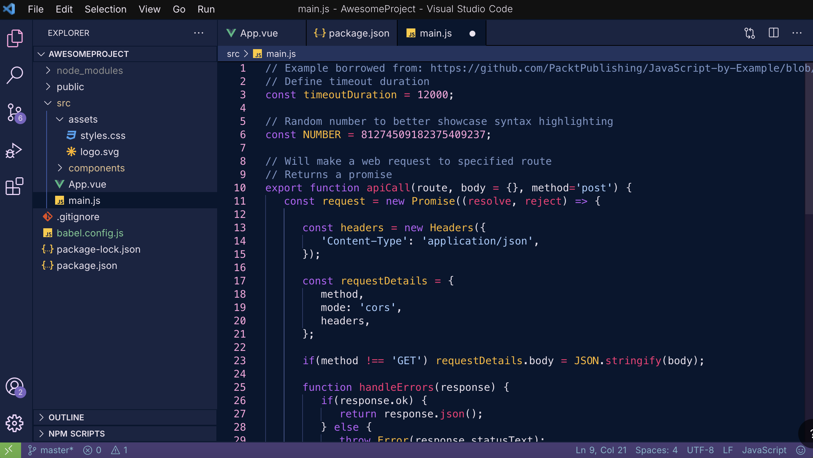

# Nebula

A VS Code color scheme composed of deep lavenders, magentas, and cornflower blues. The color theme 
is inspired by astrophotography of the Orion nebula, hence the "nebula" name.

## Screenshots:

